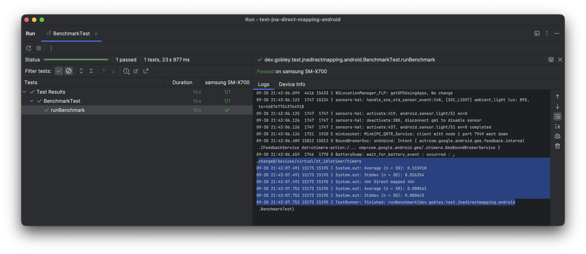

# JNA Direct Mapping Benchmark on Android

Compares the performance of JNA interface mapping and direct mapping on Android.

## How to run

There are [one instrumented test](src/androidTest/kotlin/BenchmarkTest.kt) and [one local test](src/test/kotlin/BenchmarkTest.kt) in the project. Open it on Android Studio or IntelliJ and run them.

## Benchmark Result

Tested on a Samsung Galaxy Tab S8 (SM-X700).

### Comparison

| Interface Mapping (seconds) | Direct Mapping (seconds) |
| --------------------------- | ------------------------ |
| 0.515918                    | 0.008561 (60x faster)    |
